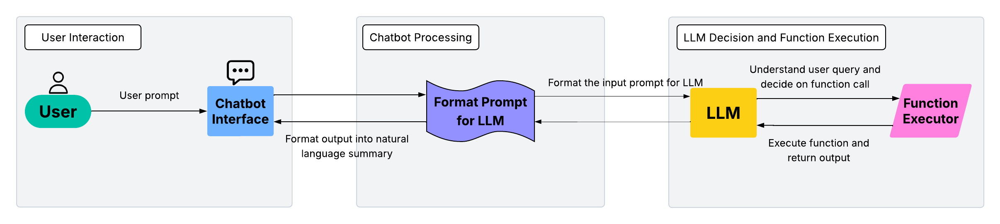
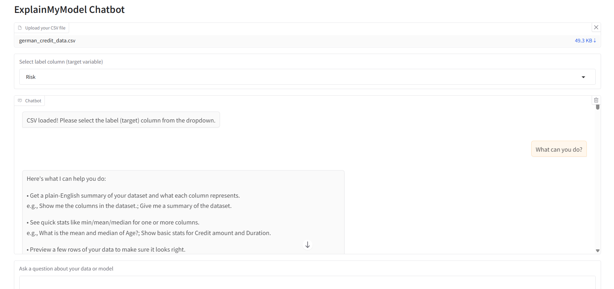
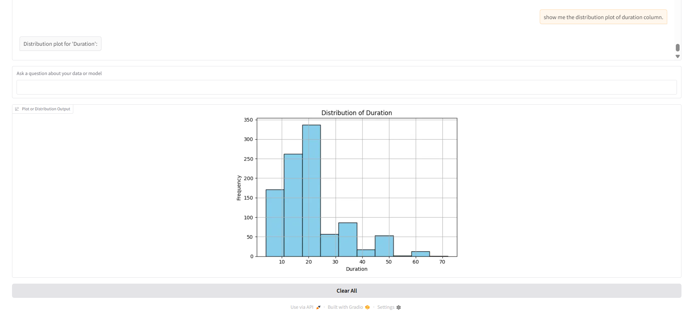

# ExplainMyModel Chatbot

This application is a **chatbot-style interface** that allows users to upload datasets and interact with a large language model (LLM) to perform machine learning (ML) and explainable AI (XAI) tasks. Using only natural language, users can easily request:
 - Dataset exploration (e.g., distribution plots, descriptive statistics)
 - ML model training
 - Label prediction for new samples
 - Model explanations with XAI methods like SHAP, LIME, and DiCE 

The LLM interprets user queries, determines the appropriate backend function to execute, processes the results, and formats them into user-friendly explanations displayed in the UI. 
This design aims to make ML and XAI accessible without requiring programming expertise.

## :pushpin: System Workflow
The flowchart below illustrates the basic architecture of the system:



## :pushpin: Setup Instructions (Windows):

1. Clone the repository:
```
git clone https://github.com/Su-Jung-Choi/xai_chatbot.git
```

2. Navigate to the project root (`xai_chatbot`) and create a virtual environment: 
```
cd xai_chatbot
python -m venv .venv
```

3. Activate the virtual environment: 
```
\.venv\Scripts\activate
```

4. Install dependencies: 
```
pip install -r requirements.txt
```

5. Set up credentials
- Create a subfolder called `env` inside `xai_chatbot/`
- Add a file called `credentials.env` containing your API key
- Make sure the variable name matches with what is in the `./main/chatbot_ui_module.py`. 
- You can also modify that script to use a different LLM provider/model.

6. Run the application: 
```
python -m main.chatbot_ui_module
```
A local URL will be displayed in your terminal. Open it in your browser to start.


## :computer: User Interface

After launching, you will see the following UI: 






Now you can start asking questions to the chat!


## :bookmark: Important Notes

Before proceeding, please review the details about the current version of the system below:

### :bulb: Data and Model Handling
- Currently supports tabular CSV data only.
- A label column must be present in the dataset.
- Pre-built models are classification models only.

### :bulb: Uploading Data
- To start the conversation, simply drop your dataset directly in the UI.
- Example datasets (`german_credit_data.csv` and `iris.csv`) are available in `./data/` folder.
- After uploading, select the label column from the dropdown menu. 

### :bulb: Model Storage
- Trained models will be saved under `./models/` folder.

### :bulb: Method Registry
- All supported methods are stored in `./myapp/method_registry.py`
- You can extend the system by adding new methods here and providing one or two example user prompts so the LLM can learn to recognize them.

### :bulb: Predicting New Samples
- Place test datasets in `./test_set/` folder.
- The file must have the same column names as the training dataset, but the label column is optional.
- Only single-row CSV files are supported in the current setting.
- The file directory must be specificed in your query. For example:
    > "Explain the prediction for **test_set/german_credit_test.csv** with SHAP."

### :bulb: Help & Guidance
If you are not sure what to ask, you can type `help` (or related queries such as _"what can you do?"_, _"instructions"_, _"guide"_, etc.) to get a list of supported methods.


## :pushpin: Demo Video

Watch the following demo of the chatbot in action, showing how it responds to user questions in the interface:


https://github.com/user-attachments/assets/1da91933-e7e3-4e82-bc6c-274ed31eff90

